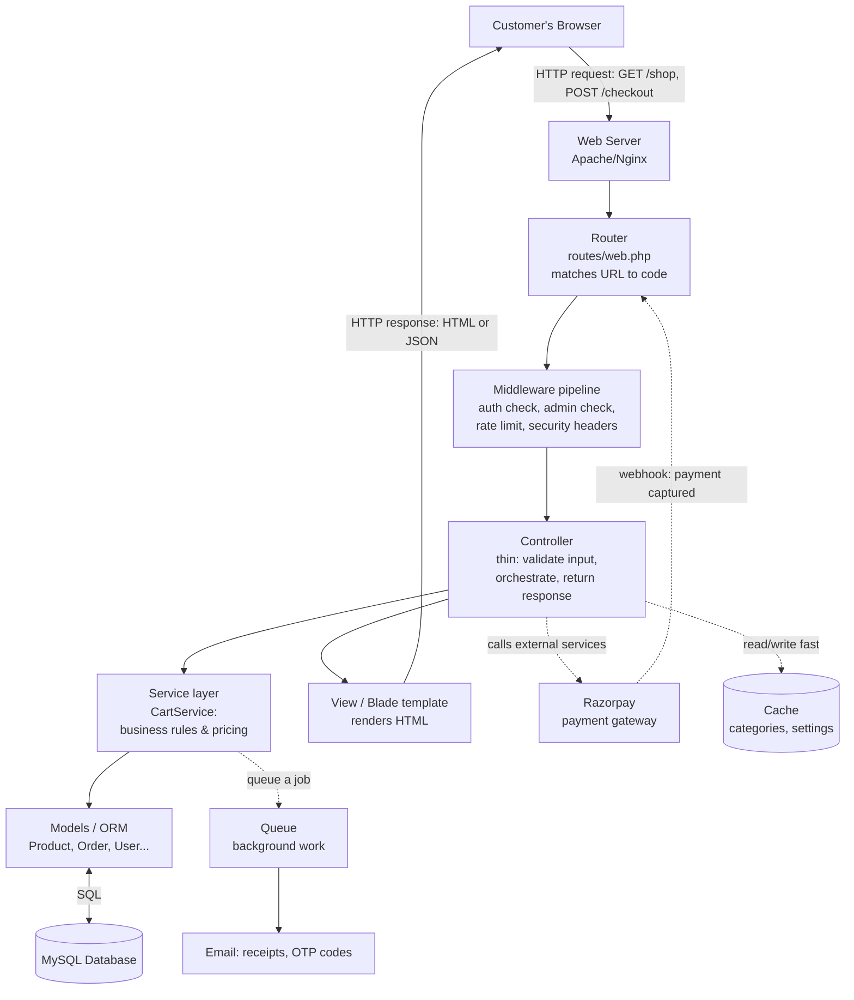

# Backend Engineering — A Course Built From Your Own Project

Welcome. This is a self-paced course that teaches **backend engineering concepts** using your store (Madhavi Stores) as the worked example. You told me two things:

1. You don't want to learn PHP/Laravel syntax right now.
2. You want to understand backend **concepts** deeply — well enough to walk into *any* backend project and understand how it's built.

So every chapter is written **concept-first**. We explain an idea the way it works *everywhere* (any language, any framework), then show *how your project happens to do it*. The PHP is only there as a concrete anchor — you can skim the code blocks and still get 100% of the learning from the prose.

---

## What is a "backend"?

When you open a website, two halves are working together:

- **Frontend** — what runs *in the visitor's browser*: the HTML, the styling, the buttons. It's what people see and click.
- **Backend** — what runs *on a server you control*: it decides what data to show, checks who you are, takes payments, saves orders to a database, and protects everything from abuse.

The backend is the part the customer never sees but always depends on. When someone clicks **"Place Order"**, the browser is just the messenger — the *real* work (is this person logged in? is the item in stock? did the payment actually succeed? save the order, decrease inventory, email a receipt) all happens in the backend. This course is about that work.

A useful mental model:

> The **frontend is a waiter** taking your request to the kitchen.
> The **backend is the kitchen** — it has the recipes (business logic), the pantry (database), the rules about who's allowed in, and the safety standards. The waiter just carries plates back and forth.

---

## Your project at a glance (the tech stack)

Don't memorise this — just get oriented. Each item links to the chapter that explains the *concept* behind it.

| Layer | What your project uses | The concept it teaches |
|---|---|---|
| **Language / Framework** | PHP + Laravel 11 | How frameworks structure a backend ([Ch 1](01-mvc-and-request-lifecycle.md)) |
| **Architecture pattern** | MVC + a Service layer | Separating "web plumbing" from "business rules" ([Ch 1](01-mvc-and-request-lifecycle.md)) |
| **Database** | MySQL (InnoDB engine) | Relational data, tables, keys, indexes ([Ch 2](02-data-modeling-and-orm.md)) |
| **Data access** | Eloquent (an ORM) | Talking to a database without writing raw SQL ([Ch 2](02-data-modeling-and-orm.md)) |
| **Login system** | Sessions + email OTP, bcrypt passwords | Authentication & authorization ([Ch 3](03-authentication-and-authorization.md)) |
| **Protection** | CSRF tokens, CSP headers, input validation | Web security & the attacker mindset ([Ch 4](04-security.md)) |
| **Abuse control** | Request throttling on login/checkout/etc. | Rate limiting ([Ch 5](05-rate-limiting-and-abuse-prevention.md)) |
| **Payments** | Razorpay (hosted checkout + webhook) | Payment gateways & 3rd-party integrations ([Ch 6](06-payments-and-third-party-integrations.md)) |
| **Correctness under load** | DB transactions + row locks | Concurrency & data integrity ([Ch 7](07-concurrency-and-data-integrity.md)) |
| **Performance / growth** | Caching, a job queue, scheduled tasks | Scalability & performance ([Ch 8](08-scalability-and-performance.md)) |
| **Confidence / design** | PHPUnit tests | Testing & system design ([Ch 9](09-testing-and-system-design.md)) |

---

## The big picture (one diagram to rule them all)

Here is the entire shape of your backend. Every later chapter zooms into one box of this picture. Read it top to bottom: a request enters at the top and a response leaves at the bottom.



**ASCII version** (if the diagram above doesn't render in your viewer):

```
Browser
   |  request
   v
Web Server  ->  Router  ->  Middleware  ->  Controller ---> View (HTML) ---> Browser
                                              |   \
                                              |    `--> Cache (fast reads)
                                              v
                                          Service (business rules)
                                              |
                                              v
                                          Models / ORM <---> Database

   (sideways) Controller <----> Razorpay (payments), Queue -> Email
```

If you understand what each box does and why it exists, you understand backend architecture. That's the whole course.

---

## How to read this course

The chapters are ordered so each one builds on the last, but they're also self-contained — you can jump to whatever you're curious about.

| # | Chapter | Read it to understand… |
|---|---|---|
| 0 | **This file** | The map and how to use it |
| 1 | [MVC & the Request Lifecycle](01-mvc-and-request-lifecycle.md) | How a click becomes a response; how code is organised |
| 2 | [Data Modeling & the ORM](02-data-modeling-and-orm.md) | How data is stored, related, and queried |
| 3 | [Authentication & Authorization](03-authentication-and-authorization.md) | How the app knows *who you are* and *what you may do* |
| 4 | [Security](04-security.md) | The common attacks and how the app defends against them |
| 5 | [Rate Limiting & Abuse Prevention](05-rate-limiting-and-abuse-prevention.md) | Stopping brute-force, scraping, and floods |
| 6 | [Payments & Third-Party Integrations](06-payments-and-third-party-integrations.md) | How money moves safely; webhooks & idempotency |
| 7 | [Concurrency & Data Integrity](07-concurrency-and-data-integrity.md) | Why two shoppers can't buy the last item; transactions & locks |
| 8 | [Scalability & Performance](08-scalability-and-performance.md) | Caching, queues, and surviving lots of traffic |
| 9 | [Testing & System Design](09-testing-and-system-design.md) | Proving it works; reading *any* backend project |

**Suggested path:** read 0 → 1 → 2 first (they're the foundation). After that, follow your interest.

---

## Conventions used in every chapter

Each chapter follows the same rhythm so you always know where you are:

- **🧠 The Concept** — the universal idea, explained plainly. *This is the part that transfers to any project.*
- **🌍 How it works anywhere** — how the concept is generally implemented across the industry.
- **🔍 In your project** — exactly how Madhavi Stores does it, with file references like `app/Services/CartService.php` so you can look if you want. **You never need to read the code to follow the lesson.**
- **📊 Diagram** — a picture when it helps.
- **✅ Takeaways** — the 3–5 things to remember.

**Jargon is always defined the first time it appears**, in plain English, like this: *idempotent — doing something twice has the same effect as doing it once.*

**A note on code references:** file paths are stable, but exact line numbers drift as code changes. I reference files and method/function names (e.g. `CartService::createOrder`) rather than line numbers, so the pointers stay correct.

---

## One promise

By the end you will be able to look at an unfamiliar backend and ask the *right questions*: Where are the routes? What does this controller actually do? Where's the database schema? How does login work? Where does money or email leave the system? What happens under heavy load? Chapter 9 turns that into a repeatable checklist.

Let's begin → [Chapter 1: MVC & the Request Lifecycle](01-mvc-and-request-lifecycle.md)
