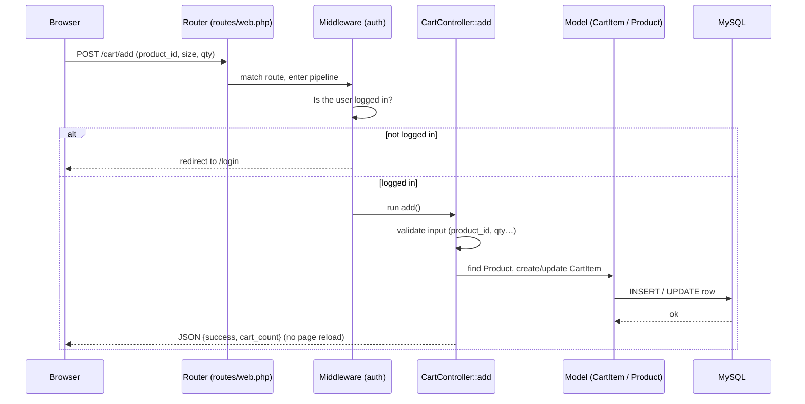

# Chapter 1 — MVC & the Request Lifecycle

*How a click in a browser becomes a response, and how backend code is organised so it doesn't become spaghetti.*

← [Back to index](00-README.md) · Next → [Chapter 2: Data Modeling & the ORM](02-data-modeling-and-orm.md)

---

## 🧠 The Concept: why we need *structure* at all

Imagine the backend as one giant file where every line does everything: reads the URL, checks the password, calculates prices, talks to the database, builds the HTML, and handles payments — all tangled together. It would "work" for a week and then become impossible to change without breaking something.

So the entire industry organises backend code by **separation of concerns**: each part of the code has *one job*. When jobs are separated, you can change one without fear of breaking the others.

The most common way to separate those concerns is a pattern called **MVC**.

---

## 🧠 The Concept: MVC (Model–View–Controller)

MVC splits your application into three responsibilities:

- **Model** — *the data and the rules about that data.* "A Product has a price and a stock count. An Order belongs to a User." Models know nothing about web pages or buttons. *(Deep dive in [Chapter 2](02-data-modeling-and-orm.md).)*
- **View** — *the presentation.* The HTML the user sees. A View knows how to *display* a product; it doesn't know how to *fetch* one.
- **Controller** — *the coordinator.* It receives the incoming request, asks the Models for data (or tells them to change), and picks a View to render. It's the air-traffic controller, not the pilot or the plane.

The point of MVC: **the View doesn't touch the database, and the Model doesn't build HTML.** Each layer can be understood, changed, and tested on its own.

A restaurant analogy:

```
Controller  = the waiter   (takes the order, coordinates, brings the result)
Model       = the kitchen + pantry  (the actual food and recipes)
View        = the plating  (how the dish is presented to the diner)
```

### Where MVC isn't enough: the Service layer

There's a classic trap. Controllers start thin, but over time people stuff *business logic* into them — pricing math, order rules, stock checks. Soon the same logic is copy-pasted across several controllers and they slowly **drift** out of sync (one place applies a discount, another forgets to). 

The fix is a **Service layer**: a place for *business rules* that's separate from both the web plumbing (controllers) and the raw data (models). A Service answers questions like "what is the *correct* total for this cart, including discounts and coupons?" — once, in one place, so every part of the app gets the same answer.

> **Rule of thumb:** Controllers should be *thin* — validate input, call a service, return a response. The interesting decisions live in services and models.

---

## 🧠 The Concept: Middleware

Some concerns apply to *many* requests, not just one: "is this user logged in?", "is this user an admin?", "add security headers", "block this IP if it's spamming us". You don't want to repeat that check at the top of every controller.

**Middleware** is code that sits *in front of* your controllers, like a series of checkpoints a request passes through before (and after) reaching its destination.

```
Request → [ Are you logged in? ] → [ Are you an admin? ] → [ Rate limit ok? ] → Controller → [ add security headers ] → Response
                checkpoint 1            checkpoint 2            checkpoint 3                        checkpoint 4
```

Each checkpoint can let the request continue, modify it, or stop it dead ("nope, you're not logged in — go to the login page"). Middleware is *the* standard way backends handle **cross-cutting concerns** — things that cut across many features.

---

## 🧠 The Concept: The Request Lifecycle

Every web backend, in every language, follows the same fundamental loop:

1. **A request arrives** — a browser sends an HTTP message: a *method* (GET = "give me", POST = "here's data, do something") and a *URL* (`/checkout`).
2. **Routing** — the backend looks at the URL and method and decides *which piece of code* should handle it. This lookup table is called the **router**.
3. **Middleware** — the request passes through the checkpoints described above.
4. **Controller** — the chosen code runs: it validates the input, does the work (often via services and models), and decides what to send back.
5. **Response** — the backend sends an HTTP message back: usually an HTML page, or **JSON** (a compact, machine-readable data format the browser's JavaScript can use without a full page reload).

This loop — request in, response out — happens fresh for *every* click. Backends are mostly **stateless** between requests: each request stands on its own, and anything that must be remembered (like "who is logged in") is stored elsewhere and looked up again. *(We'll see why statelessness matters enormously in [Chapter 8](08-scalability-and-performance.md).)*

---

## 🔍 In Your Project

Your app is built on **Laravel**, a PHP framework that implements exactly this MVC-plus-services-plus-middleware structure. Here's where each piece lives:

| Concept | Where it lives in your project |
|---|---|
| **Router** | `routes/web.php` — the master list of every URL the site answers |
| **Controllers** | `app/Http/Controllers/` — 8 of them (Home, Product, Cart, Checkout, Auth, Wishlist, Admin, Sitemap) |
| **Service layer** | `app/Services/CartService.php` — the pricing & order-creation brain |
| **Models** | `app/Models/` — Product, Order, User, Coupon, CartItem, … (covered in Ch 2) |
| **Views** | `resources/views/` — Blade templates (`.blade.php`) that produce HTML |
| **Middleware** | `app/Http/Middleware/` — CheckAdmin, SecurityHeaders, and more |

### The router: a URL-to-code phone book

`routes/web.php` is literally a list that says "when this URL is requested, run this controller method." A few real lines from your project, translated to plain English:

```php
Route::get('/shop', [ProductController::class, 'index'])->name('shop');
// "When someone GETs /shop, run the index() method of ProductController."

Route::post('/checkout', [CheckoutController::class, 'store'])
     ->middleware('throttle:20,1')->name('checkout.store');
// "When someone POSTs to /checkout, first rate-limit them (max 20/min),
//  then run CheckoutController::store()."
```

Notice the routes are **grouped by who's allowed in** — this is middleware doing access control at the routing level:

```php
Route::middleware('guest')->group(function () { ... });   // only logged-OUT users (login, register)
Route::middleware('auth')->group(function () { ... });    // only logged-IN users (cart, checkout)
Route::middleware(['auth', 'admin'])->prefix('admin')->group(function () { ... }); // only admins
```

That single `['auth', 'admin']` line is why a customer can never reach `/admin/products` — the request is stopped at the middleware checkpoint long before any admin code runs. *(Auth details in [Chapter 3](03-authentication-and-authorization.md).)*

### Thin controllers calling a service

Your `CheckoutController` is a textbook example of a **thin controller**. Look at what its `index()` method actually does (`app/Http/Controllers/CheckoutController.php`):

```php
public function index()
{
    $summary = $this->cart->getSummary(Auth::user());   // ask the service for the truth
    if ($summary['cartItems']->isEmpty()) {
        return redirect()->route('cart')->with('error', 'Your shopping bag is empty.');
    }
    return view('pages.checkout', [...]);               // hand data to a view
}
```

The controller doesn't calculate prices, apply discounts, or validate coupons. It *asks `CartService` for the summary* and then renders a view. All the hard, get-it-wrong-and-you-lose-money logic lives in **one** place: `CartService`.

Your project's own code comments explain *why* this service exists — and it's the single best lesson in the whole codebase:

> *"Previously the subtotal → coupon → discount → total math was copy-pasted in six places … and had drifted (cart ignored per-user coupon limits that checkout enforced). Centralising it here guarantees the cart, checkout and the charged total can never disagree."* — `app/Services/CartService.php`

That is the Service-layer concept in one paragraph: **don't repeat important business logic; centralise it so it can't disagree with itself.**

### Middleware in action

Two of your middleware classes (`app/Http/Middleware/`):

- **`CheckAdmin`** — the checkpoint on every `/admin/*` route. In plain English: "If you're not logged in, go to login. If you're logged in but not an admin, go home. Otherwise, carry on." A customer literally cannot get past it.
- **`SecurityHeaders`** — runs on the *way out*, attaching protective headers to every response (more on these in [Chapter 4](04-security.md)).

---

## 📊 Diagram: "Add to Cart", end to end

Let's trace one real action through every layer. The customer clicks **Add to Cart**.



Read it as a story: the browser sends data → the router finds the right code → the *auth* checkpoint confirms the user is logged in → the controller validates the input and asks the models to save a cart row → the database stores it → a small JSON reply updates the cart icon without reloading the page. **Every feature in your app is a variation of this same journey.**

---

## ✅ Takeaways

1. **Separation of concerns** is the reason backends are organised at all — each layer has one job so you can change it safely.
2. **MVC** = Models (data + rules), Views (presentation), Controllers (coordination). Views don't touch the database; Models don't build HTML.
3. **Services** hold business logic so it lives in *one* place and can't drift. Your `CartService` is the canonical example — pricing lives there, not scattered across controllers.
4. **Middleware** handles cross-cutting concerns (auth, admin checks, security headers, rate limits) as checkpoints in front of controllers.
5. **The request lifecycle** is always the same loop: *request → route → middleware → controller → (service → model → DB) → view → response.* Learn this loop once and you can read any backend.

Next, we open up the "Model + Database" box → [Chapter 2: Data Modeling & the ORM](02-data-modeling-and-orm.md)
