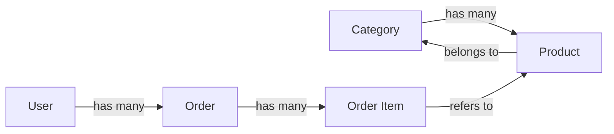
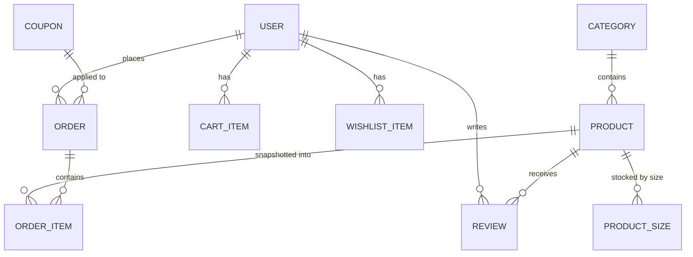

# Chapter 2 — Data Modeling & the ORM

*Where your data actually lives, how the pieces relate, and how code reads and writes it without drowning in SQL.*

← [Back to Chapter 1](01-mvc-and-request-lifecycle.md) · Next → [Chapter 3: Authentication & Authorization](03-authentication-and-authorization.md)

---

## 🧠 The Concept: the database is the source of truth

The frontend forgets everything the moment you close the tab. The backend's job is to *remember* — every product, every order, every user — permanently and reliably. That memory lives in a **database**.

Most business applications, including yours, use a **relational database**. The idea is 50 years old and still dominant because it's simple and trustworthy:

- Data is stored in **tables** (like spreadsheets).
- Each table has **columns** (fields, e.g. `name`, `price`) and **rows** (records, e.g. one specific product).
- Tables can **relate** to each other (an order's rows point to a customer's row).

Your project uses **MySQL**, one of the most popular relational databases. (Others you'll hear about: PostgreSQL, SQLite, SQL Server. The concepts in this chapter apply to all of them.)

---

## 🧠 The Concept: keys and relationships

How does the database know that *this order* belongs to *that customer*? With **keys**.

- **Primary key** — a unique ID for every row in a table. Almost always a column called `id` that auto-increments: 1, 2, 3… No two rows share an `id`. It's the row's fingerprint.
- **Foreign key** — a column in one table that holds the primary key of a row in *another* table. That's the "link."

Example: the `orders` table has a `user_id` column. If an order's `user_id` is `42`, that order belongs to the user whose `id` is `42`. That one number *is* the relationship.

Relationships come in a few standard shapes — and these names are universal across all backends:

| Shape | Meaning | Example in a store |
|---|---|---|
| **One-to-many** | one row owns many rows in another table | one **Category** has many **Products** |
| **Many-to-one** (the same link, seen from the other side) | many rows point to one | many **Products** belong to one **Category** |
| **Many-to-many** | rows on both sides link to many on the other | **Products** ↔ **Tags** (a product has many tags; a tag is on many products) |



---

## 🧠 The Concept: normalization vs. denormalization

**Normalization** means storing each fact in exactly *one* place to avoid contradictions. You don't copy the customer's name onto every order; you store the customer once and *point* to them. If they change their name, there's only one place to update.

But there's a tension. Sometimes *re-deriving* a fact every time is expensive. Example: "what's this product's average review rating?" To compute it perfectly, you'd average *all* its reviews on *every* page load. On a product list with 50 items, that's 50 expensive calculations per visit.

**Denormalization** is the deliberate exception: you *store a computed/copied value* for speed, accepting that you now have to keep it updated. You'd store `rating` and `review_count` directly on the product, and recalculate them only when a review is added or removed — not on every page view.

> Normalization keeps data *correct*. Denormalization keeps reads *fast*. Real systems use mostly the former with a few careful doses of the latter. **The skill is knowing when the trade is worth it.**

There's a second, related pattern: an **immutable snapshot**. When an order is placed, you copy the product's *name and price at that moment* onto the order line. Why? Because if the shop later raises the price or renames the product, the old order must still show what the customer *actually paid*. The order is a historical record; it must not change when the catalog changes.

---

## 🧠 The Concept: indexes (why some queries are instant and others crawl)

Suppose you have 100,000 products and you ask "show me everything in category 5." Without help, the database must check *every single row* — a "full table scan." Slow.

An **index** is a pre-sorted lookup structure (usually a tree, specifically a *B-tree*) that lets the database jump straight to matching rows, the way a book's index lets you find a topic without reading every page.

- **Pro:** reads (searching, filtering, sorting) on the indexed column become dramatically faster.
- **Con:** every index must be *updated* whenever you insert/change a row, so indexes slightly slow down writes and use disk space.

So you don't index everything — you index the columns you frequently **filter by, sort by, or join on**. Typical candidates: foreign keys (`category_id`, `user_id`), anything you search (`slug`, `email`), and anything you sort by (`created_at`, `price`).

A special kind, the **unique index**, does double duty: it speeds up lookups *and* enforces "no duplicates" — e.g. two users can't share an email, two products can't share a URL slug.

---

## 🧠 The Concept: the ORM (talking to the DB without writing SQL)

Databases speak **SQL** (Structured Query Language): `SELECT * FROM products WHERE category_id = 5`. You *can* write SQL by hand, but in a big app that gets repetitive and error-prone — and, importantly, **dangerous** if you build queries by gluing user input into strings (that's the SQL-injection attack in [Chapter 4](04-security.md)).

An **ORM (Object-Relational Mapper)** is a translation layer. It lets you work with database rows as if they were normal objects in your programming language:

```
// Instead of writing SQL by hand:
SELECT * FROM products WHERE category_id = 5 ORDER BY created_at DESC

// You write code like:
Product::where('category_id', 5)->latest()->get();
```

The ORM turns that into safe SQL for you, runs it, and hands back `Product` objects you can use. Benefits:

- **Safety** — the ORM automatically *parameterises* values, which neutralises SQL injection.
- **Readability** — `order->user->email` instead of manual joins.
- **Portability** — switch databases (MySQL → PostgreSQL) with little code change.

The trade-off: an ORM can hide *how much* work it's doing. The classic mistake is the **N+1 query problem** — looping over 50 orders and lazily fetching each order's user one at a time = 51 queries instead of 2. (We'll see the fix — *eager loading* — in [Chapter 8](08-scalability-and-performance.md).)

---

## 🧠 The Concept: migrations (version control for your database)

Your *code* lives in files you can track, review, and roll back. But your database *structure* (which tables and columns exist) also changes over time — and it lives on a server, not in a file. How do you keep every developer's database, and the production database, in identical shape?

**Migrations.** A migration is a small file that describes a *change* to the schema: "create a `coupons` table," "add a `razorpay_payment_id` column to `orders`," "add an index on `created_at`." They're numbered/timestamped and run in order. Running them on a fresh database rebuilds the entire structure step by step. They are, effectively, **version control for your schema** — and they're how schema changes get reviewed and deployed safely.

---

## 🔍 In Your Project

### The schema (your real tables)

Your migrations in `database/migrations/` (≈30 of them) build these core tables:

| Table | Holds | Key relationships |
|---|---|---|
| `users` | accounts, hashed passwords, `role` | has many orders, cart_items, wishlist_items |
| `products` | catalog items, price, stock, discounts | belongs to a category; has many sizes, reviews |
| `product_sizes` | per-size stock (M/L/XL) for sized products | belongs to a product |
| `categories` | collections | has many products |
| `orders` | order header: totals, status, payment IDs | belongs to a user; has many order_items |
| `order_items` | one line per product in an order (**snapshot**) | belongs to an order; refers to a product |
| `cart_items` | the live shopping bag | belongs to a user & product |
| `wishlist_items` | saved favourites | belongs to a user & product |
| `coupons` | discount codes, limits, usage counts | referenced by orders |
| `reviews` | ratings + comments | belongs to a user & product |
| `otp_codes` | one-time email codes (login/reset) | keyed by email |
| `settings` | site config as flexible key→value | — |

### 📊 Entity-Relationship diagram



Read `||--o{` as "one-to-many": the `||` side is the *one*, the `o{` side is the *many*. So **one** USER places **many** ORDERs.

### Your models *are* the relationships, in code

In Laravel's ORM (called **Eloquent**), each table has a Model class that *declares* its relationships. Your `User` model (`app/Models/User.php`) literally says:

```php
public function orders()        { return $this->hasMany(Order::class); }
public function cartItems()     { return $this->hasMany(CartItem::class); }
public function wishlistItems() { return $this->hasMany(WishlistItem::class); }
```

That's the "one-to-many" concept written as code. Now anywhere in the app, `$user->orders` gives you all of that user's orders — the ORM writes the SQL and the join for you. Your `Product` model mirrors it from the other side: `belongsTo(Category::class)`, `hasMany(ProductSize::class)`, `hasMany(Review::class)`.

### Denormalization, exactly as described — in your `Product`

Your products table stores `rating` and `review_count` *directly on the product* (denormalized for fast listing pages). They are **not** recalculated on every page view; instead, your `Review` model recomputes them only when a review is saved or deleted. Your `Product` model even guards this on purpose:

```php
// app/Models/Product.php
protected $fillable = [ 'category_id', 'name', 'slug', 'price', /* … */ ];
// NOTE: 'rating' and 'review_count' are intentionally NOT mass-assignable — they are
// derived aggregates maintained by the Review model's recompute hook.
```

That comment is the denormalization concept in practice: *those two columns are computed values, so only the recompute hook is allowed to set them.* (The "not mass-assignable" part is also a security control — see [Chapter 4](04-security.md).)

### The immutable snapshot — your `order_items`

When `CartService::createOrder` builds an order, it copies the product's name and price onto each line *at that moment*:

```php
// app/Services/CartService.php
OrderItem::create([
    'product_name' => $item->product->name,        // snapshot of the name
    'price'        => $item->product->final_price,  // snapshot of the price paid
    'quantity'     => $item->quantity,
    // …
]);
```

If you rename or re-price that product next month, this order still shows what the customer actually bought and paid. That's the historical-record principle in action.

### Single source of truth — the `final_price` accessor

Here's a beautiful little pattern. A product's *displayed* price and *charged* price must never disagree. Rather than recompute the discount in many places, your `Product` model exposes one computed property, `final_price`:

```php
// app/Models/Product.php — getFinalPriceAttribute()
// Applies discount_type/discount_value to the base price, never goes below 0.
```

The cart, the product page, **and** the checkout charge all read `final_price`. One formula, one place. This is the [Chapter 1](01-mvc-and-request-lifecycle.md) "don't let logic drift" lesson applied at the data layer.

### Deliberate indexing

Your migrations don't index blindly; they index the columns your pages actually filter and sort by. For example, products are indexed on `category_id` (filter by collection), `slug` (look up a product by its URL), `created_at` (sort "new arrivals"), `price` (price-range filters), and flags like `is_bestseller`. Orders are indexed on `user_id` (a customer's history), `created_at` (admin sales charts), and status columns. And crucially:

- `users.email` is a **unique** index — enforces "one account per email" *and* makes login lookups instant.
- `products.slug` is **unique** — no two products can share a URL.
- `product_sizes (product_id, size)` is a **unique composite** index — a product can't have two "M" rows.

Each is a textbook reason-to-index: foreign key, search column, sort column, or uniqueness rule.

### The storage engine matters

A small but important detail: your `config/database.php` explicitly pins MySQL's **InnoDB** engine, with a comment explaining why — InnoDB supports **transactions** and **row locking**, which the older MyISAM engine silently ignores. Those two features are what make your checkout safe under concurrent shoppers. We'll spend all of [Chapter 7](07-concurrency-and-data-integrity.md) on them; just note here that *the choice of storage engine is a real backend decision with correctness consequences.*

---

## ✅ Takeaways

1. **Relational databases** store data as related tables; your **primary keys** (`id`) identify rows and **foreign keys** (`user_id`) link them.
2. Relationships have standard shapes — **one-to-many, many-to-one, many-to-many** — and your Eloquent models declare them in code (`hasMany`, `belongsTo`).
3. **Normalize by default** (one fact, one place); **denormalize deliberately** for speed (your `rating`/`review_count`) and **snapshot** historical data (your `order_items`).
4. **Indexes** make reads fast at a small write cost — index what you filter, sort, join, or must keep unique. Your migrations do exactly this.
5. An **ORM** lets you treat rows as objects, writes safe SQL for you, and prevents SQL injection — at the cost of hiding query volume (watch for N+1).
6. **Migrations** are version control for your schema, making database changes reviewable and repeatable.

Next: how the app knows *who you are* → [Chapter 3: Authentication & Authorization](03-authentication-and-authorization.md)
