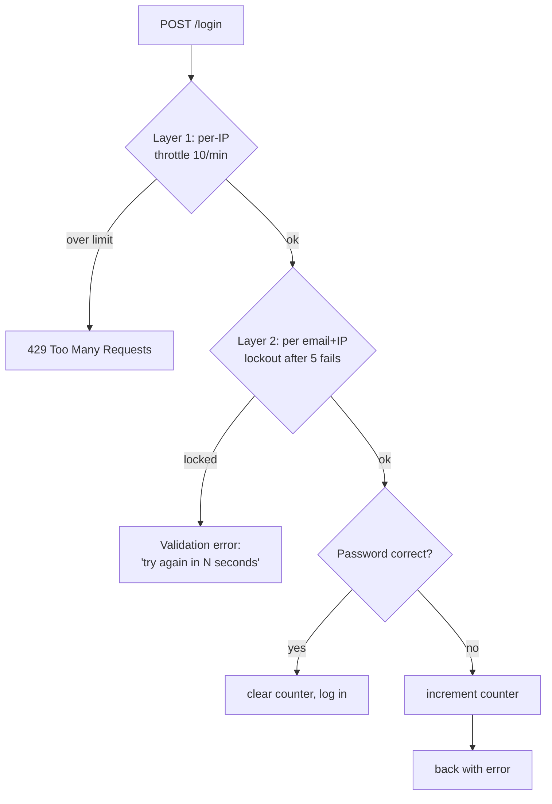

# Chapter 5 — Rate Limiting & Abuse Prevention

*How a backend protects itself from too many requests — whether malicious (brute-force, scraping, floods) or merely accidental.*

← [Back to Chapter 4](04-security.md) · Next → [Chapter 6: Payments](06-payments-and-third-party-integrations.md)

---

## 🧠 The Concept: why limit requests at all?

Your server can only do so much work per second. If nothing stops a single client from sending thousands of requests a minute, three bad things happen:

1. **Brute-force** — an attacker tries millions of password or coupon guesses until one works.
2. **Scraping** — a bot vacuums your entire catalog/prices to copy or undercut you.
3. **Overload / DoS** — a flood of requests (deliberate "Denial of Service," or just a buggy script) exhausts your CPU/database and the site goes down *for everyone*.

**Rate limiting** caps how many requests a given client may make in a given time window. It's a fundamental backend control — part security, part stability.

> Analogy: a nightclub with a door policy. The bouncer doesn't inspect what each person does inside; they just control *how fast* people can come through the door. That alone prevents stampedes.

---

## 🧠 The Concept: the "limit key" — *limit per what?*

A rate limit always counts requests *per some identity*. Choosing that identity (the **key**) is the whole game:

- **Per IP address** — simplest. "This IP may make 60 requests/minute." Good default, but imperfect: many users behind one office/Wi-Fi share an IP, and attackers can rotate IPs.
- **Per user account** — "this logged-in user may…". Good for actions only logged-in users perform.
- **Per email + IP (combined)** — excellent for login: it stops someone hammering *one specific account* (per email) regardless of which IP they attack from, while not punishing an entire shared network.
- **Per API key** — for public APIs, each consumer gets their own budget.

You often layer several keys (per-IP *and* per-account) — defense in depth again.

---

## 🧠 The Concept: the algorithms (how the counting works)

There are four classic ways to actually implement "X per window." You don't need to build these — frameworks include them — but knowing the names and trade-offs lets you read any system.

### 1. Fixed window
Count requests in fixed clock buckets: "max 100 per minute, resetting at the top of each minute."
- ✅ Dead simple, cheap.
- ❌ **Edge bursting:** a client can send 100 at 11:00:59 and 100 more at 11:01:00 — 200 in two seconds, because the counter reset.

### 2. Sliding window
Track a *rolling* 60-second window rather than fixed clock minutes, smoothing out that burst.
- ✅ Fairer, no edge spikes.
- ❌ Slightly more bookkeeping.

### 3. Token bucket (the most popular)
Picture a bucket that holds, say, 100 **tokens**. Each request spends one token. Tokens **refill at a steady rate** (e.g. 10/second). If the bucket's empty, you're refused until it refills.
- ✅ Allows short **bursts** (spend the whole bucket at once) while enforcing a steady **average** rate. Matches real human behaviour (people click in bursts, then pause).
- This is what most APIs (and cloud providers) use.

### 4. Leaky bucket
Requests queue and are processed (leak out) at a constant rate; overflow is dropped.
- ✅ Produces a perfectly smooth, constant output rate.
- Used where you must protect a downstream system from any spikes at all.

```
Token bucket (allows bursts, steady average):

   refill 10/sec
        |
        v
   [ ● ● ● ● ● ● ● ● ● ● ]  capacity 100
        |  each request removes one ●
        v
   request allowed if a ● is available, else 429 Too Many Requests
```

When a client exceeds the limit, the server replies with HTTP status **429 "Too Many Requests"**, usually with a hint of how long to wait. (Status codes: `200` ok, `4xx` "you did something wrong" — `429` is one of these — `5xx` "the server failed.")

---

## 🧠 The Concept: graduated responses

Refusing isn't the only tool. Mature systems escalate:

- **Throttle** — slow the client down (delay or 429) but let them keep trying later.
- **Lockout / backoff** — after N failures, block for a cooling-off period that often *grows* with repeated abuse (exponential backoff).
- **Challenge** — insert a CAPTCHA or extra verification when behaviour looks robotic.

For sensitive endpoints (login), you *lock out* after a few failures. For merely expensive ones (search), you *throttle*. Matching the response to the risk is the craft.

---

## 🔍 In Your Project

Your project rate-limits exactly the endpoints that need it, with limits tuned to each endpoint's risk. Two layers are in play.

### Layer 1 — route-level throttling

In `routes/web.php`, sensitive routes carry a `throttle:MAX,MINUTES` middleware. Reading them tells a story about *what each endpoint is afraid of*:

| Route | Limit | What it's defending against |
|---|---|---|
| `POST /login` | `throttle:10,1` (10/min) | password brute-force |
| `POST /register` | `throttle:5,1` | fake-account spam |
| `POST /verify-email` | `throttle:5,1` | OTP code guessing |
| `POST /verify-email/resend` | `throttle:3,10` (3 per 10 min) | OTP email-bombing someone |
| `POST /forgot-password` | `throttle:5,1` | reset-spam / enumeration |
| `POST /reset-password` | `throttle:5,1` | reset abuse |
| `GET /search/suggestions` | `throttle:60,1` | catalog scraping |
| `POST /coupon/apply` | `throttle:10,1` | guessing valid coupon codes |
| `POST /checkout` | `throttle:20,1` | each call hits Razorpay's API |
| `POST /checkout/verify` | `throttle:20,1` | payment-verify abuse |

Notice the limits aren't uniform — they're **risk-weighted**. Search allows 60/min (it's read-only and users type fast), but OTP-resend allows only 3 per *ten* minutes (because each one emails a real person — a higher abuse cost). The code comments say so directly, e.g. on coupon apply:

```php
// Coupon apply is brute-forceable for valid codes — throttle it.
Route::post('/coupon/apply', [CartController::class, 'applyCoupon'])
     ->middleware('throttle:10,1')->name('coupon.apply');
```

…and on checkout:

```php
// Checkout Operations (throttled — each store() can hit the Razorpay API)
Route::post('/checkout', [CheckoutController::class, 'store'])->middleware('throttle:20,1');
```

That last one shows a subtle reason to rate-limit beyond security: **protecting a downstream third party.** Every checkout call costs a Razorpay API call; throttling keeps you within *their* limits and controls cost.

This route-level throttle is keyed **per IP** by default — Layer 1 is your broad net.

### Layer 2 — a custom per-account lockout on login

The route throttle alone isn't enough for login. An attacker spreading guesses across many IPs could still hammer *one* account. So your `AuthController` adds a **second, finer limiter keyed on email + IP**:

```php
// app/Http/Controllers/AuthController.php
private function throttleKey(Request $request): string {
    return Str::transliterate(Str::lower((string) $request->input('email')) . '|' . $request->ip());
}

private function ensureIsNotRateLimited(Request $request): void {
    if (! RateLimiter::tooManyAttempts($this->throttleKey($request), 5)) return;  // 5 strikes
    $seconds = RateLimiter::availableIn($this->throttleKey($request));
    throw ValidationException::withMessages([
        'email' => 'Too many login attempts. Please try again in ' . $seconds . ' seconds.',
    ]);
}
```

And the lifecycle around a login attempt:

```php
$this->ensureIsNotRateLimited($request);              // refuse early if locked out
if (Auth::attempt(...)) {
    RateLimiter::clear($this->throttleKey($request));  // success → wipe the counter
    // …
}
RateLimiter::hit($this->throttleKey($request));        // failure → increment the counter
```

This is the *graduated lockout* pattern from the concept section: count failures per account, lock after 5, tell the user exactly how long to wait, and **reset the counter on a successful login** so legitimate users who simply mistyped aren't punished after they get in. Two layers — broad per-IP throttle *plus* targeted per-account lockout — is textbook defense in depth.

### 📊 Diagram: the two layers guarding login



A request must clear *both* gates before a password is even checked, and the per-account counter only resets on success.

---

## ✅ Takeaways

1. **Rate limiting caps requests per client per time window** — defending against brute-force, scraping, and overload, and protecting downstream services and costs.
2. The **limit key** decides "per what" — per IP, per user, per email+IP, per API key. Combining keys gives layered protection.
3. Know the four **algorithms**: fixed window (simple, bursty), sliding window (smoother), **token bucket** (bursts + steady average — the popular default), and leaky bucket (perfectly smooth). Over-limit → HTTP **429**.
4. Match the **response to the risk**: throttle cheap endpoints, **lock out** sensitive ones (login), and reset counters on success so real users aren't penalised.
5. Your project does both layers: **risk-weighted per-IP route throttles** on every sensitive endpoint *plus* a **custom per-email+IP lockout** on login — and even throttles checkout to respect Razorpay's API.

Next: how money moves safely → [Chapter 6: Payments & Third-Party Integrations](06-payments-and-third-party-integrations.md)
