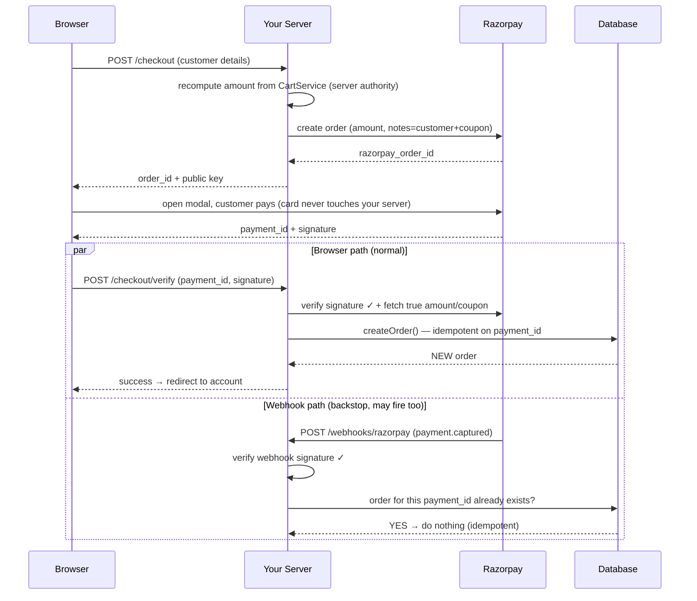

# Chapter 6 — Payments & Third-Party Integrations

*How money moves through an online store without you ever touching a card number — and the patterns (webhooks, signatures, idempotency) that make any external integration trustworthy.*

← [Back to Chapter 5](05-rate-limiting-and-abuse-prevention.md) · Next → [Chapter 7: Concurrency](07-concurrency-and-data-integrity.md)

---

## 🧠 The Concept: who's who in an online payment

When a customer pays, several parties are involved. You only deal directly with one of them:

- **Cardholder** — your customer.
- **Merchant** — you, the store.
- **Payment gateway** — the service you integrate with (Razorpay, Stripe, PayPal…). It's the secure middleman that actually collects the card details and talks to the banks.
- **Acquiring bank** — the merchant's bank, which receives the funds.
- **Issuing bank** — the customer's bank, which approves or declines the charge.
- **Card network** — Visa/Mastercard/etc., the rails connecting the banks.

The flow, simplified: customer → gateway → card network → issuing bank (approve?) → back through the chain → money settles to your acquiring bank. The gateway hides this entire mess behind a simple integration.

---

## 🧠 The Concept: PCI-DSS — why you must NOT handle card data

Card data is radioactive. Storing or even *touching* raw card numbers makes you subject to **PCI-DSS** (Payment Card Industry Data Security Standard) — a heavy compliance burden — and one breach could end your business. 

**The golden rule: never let raw card numbers reach your server.** The gateway handles them; you only ever see safe references (a payment ID, the last 4 digits). This is why modern integrations use one of:

- **Hosted checkout / drop-in modal** — the gateway shows the card form (in its own iframe/popup), collects the card *directly*, and hands your server only a token/ID afterward. Card data goes customer → gateway, **bypassing you entirely**. Lowest compliance burden.
- **Direct API** — you collect card data and send it yourself. Powerful but puts you in full PCI scope. Most small/medium stores avoid it.

Your project uses the **hosted modal** approach — the safe, standard choice.

---

## 🧠 The Concept: the two-phase payment flow

A gateway payment almost always has two phases, and understanding *why* unlocks everything:

1. **Create an order/intent (server → gateway, before payment).** Your server tells the gateway "I'm about to collect ₹2,499 from this customer; here's a reference." The gateway returns an **order ID**. Crucially, *your server sets the amount here* — the customer can't change it.
2. **Collect payment (customer ↔ gateway, in the browser).** The gateway's modal opens, the customer pays, and the gateway returns a **payment ID** and a **signature** to the browser, which forwards them to your server.
3. **Verify & fulfil (server).** Your server **verifies the signature** (proving the gateway really approved *this* payment for *this* amount), then records the order and ships the goods.

The reason for the dance: the sensitive money-handling happens between the customer and the gateway, while *your* server keeps authority over the amount and the final fulfilment.

---

## 🧠 The Concept: signature verification (don't trust the messenger)

The payment result arrives *through the customer's browser*. But the browser is attacker-controllable — a malicious customer could fake a "payment succeeded" message. How do you know it's real?

**Cryptographic signatures.** When the gateway approves a payment, it computes a **signature**: a fingerprint of the payment details, created using a **secret key that only you and the gateway know** (this is **HMAC** — a keyed hash). Your server recomputes the same fingerprint with your copy of the secret and checks they match.

- Match → the message genuinely came from the gateway and wasn't tampered with. The amount and IDs are authentic.
- No match → forged or altered. Reject it.

Because the attacker doesn't have the secret key, they *cannot* produce a valid signature for a fake payment. This is the same idea as the CSRF token ([Chapter 4](04-security.md)) but cryptographic: **prove authenticity without trusting the transport.**

---

## 🧠 The Concept: webhooks (the gateway calls *you* back)

Here's a real problem: the customer pays successfully… then their phone dies, or they close the tab *before* the browser tells your server. The money left their account, but your server never got the "success" message. Order lost, customer furious.

The fix is a **webhook**: a URL on *your* server that the **gateway calls directly** (server-to-server) whenever something happens ("payment.captured"). It doesn't depend on the customer's browser at all. So you have *two* independent paths that can create the order:

- **The browser path** (fast, normal case).
- **The webhook path** (reliable backstop, fires even if the browser vanished).

A webhook is just an inbound HTTP request *you* receive from someone else's server. Because anyone could POST to that public URL pretending to be the gateway, webhooks are also **signature-verified** (same idea as above, with a dedicated webhook secret).

---

## 🧠 The Concept: idempotency (the most important word in payments)

> **Idempotent** — an operation you can safely repeat: doing it twice has the *same* effect as doing it once.

Now combine the last two ideas: you have *two* paths that might create the order (browser **and** webhook), and webhooks are often *retried* by the gateway if they don't get a quick "OK." So the "create order" operation might genuinely be triggered **2, 3, or more times for one payment.** Without protection, the customer gets charged once but receives three orders, and your stock is decremented three times.

**Idempotency** solves this. You pick a key that's unique to the real-world event — here, the gateway's **payment ID** — and make order-creation check it first: *"Have I already created an order for this payment ID? If yes, return that existing order and do nothing else."* Now it doesn't matter how many times the operation fires; exactly one order exists.

This pattern — **idempotency keyed on a unique external ID** — appears all over backend engineering (payment processing, message queues, API retries). Learn it once; you'll see it everywhere.

---

## 🧠 The Concept: integrating *any* third party safely

Payments are the highest-stakes integration, but the same discipline applies to *every* external service you call (email providers, SMS, social media APIs, shipping):

- **Keep secrets in config/`.env`**, never in code ([Chapter 4](04-security.md)).
- **Assume it can fail or be slow.** Networks time out. Wrap calls so a third-party outage degrades gracefully instead of crashing your app or blocking the user.
- **Verify anything that comes back** if it affects money or trust (signatures).
- **Be idempotent** wherever retries are possible.
- **Log** every important exchange so you can debug and audit later.
- **Reconcile** — periodically check that *your* records agree with *theirs*.

---

## 🔍 In Your Project

Your store integrates **Razorpay** (an Indian payment gateway) using exactly this playbook. The code lives in `app/Http/Controllers/CheckoutController.php` and `app/Services/CartService.php`.

### Phase 1 — create the gateway order (`CheckoutController::store`)

The server fixes the amount (recomputed from `CartService`, *never* taken from the browser) and asks Razorpay to create an order:

```php
// app/Http/Controllers/CheckoutController.php — store()
$razorpayOrder = $api->order->create([
    'amount'          => intval(round($total * 100)),   // server-decided amount, in paise
    'currency'        => 'INR',
    'payment_capture' => 1,
    'notes'           => array_merge($customer, [       // ← stash data for the webhook to use later
        'user_id' => (string) $user->id,
        'coupon_code' => $summary['couponCode'] ?? '',
    ]),
]);
```

Two clever details: (1) the amount is multiplied to **paise** (gateways use the smallest currency unit to avoid decimal rounding bugs — a real backend gotcha), and (2) the customer details are tucked into Razorpay's `notes`, so if the browser disappears, the **webhook can still rebuild the order** from data Razorpay echoes back.

It also degrades gracefully: if real keys aren't configured, it returns a *mock* order in local development, and a clean "payment not configured, contact support" error in production — never a crash.

### Phase 2 — collect payment (the browser)

Razorpay's modal opens in the customer's browser, collects the card/UPI details **directly** (your server never sees them — PCI-safe), and returns a `razorpay_payment_id` and `razorpay_signature`.

### Phase 3 — verify & fulfil (`CheckoutController::verifyPayment`)

The browser sends the IDs and signature back. Your server **verifies the signature before trusting anything**:

```php
// app/Http/Controllers/CheckoutController.php — verifyPayment()
$api->utility->verifyPaymentSignature([
    'razorpay_order_id'   => $request->razorpay_order_id,
    'razorpay_payment_id' => $request->razorpay_payment_id,
    'razorpay_signature'  => $request->razorpay_signature,
]);   // throws if the signature is invalid → request rejected
```

Then — and this is a sharp security touch — it does **not** trust the coupon sitting in the browser session. It re-reads the coupon and the charged amount from the *gateway's* copy of the order (the source of truth):

```php
$couponCode = null;   // never trust the session here
$razorpayOrder = $api->order->fetch($request->razorpay_order_id);
$couponCode = ($razorpayOrder['notes']['coupon_code'] ?? '') ?: null;
$paidAmount = $razorpayOrder['amount'] ?? null;
```

Why? Otherwise a customer could pay for a small cart, then swap to a bigger coupon before this step and get under-charged. The price that was *paid* is authoritative, not whatever the browser now claims.

### Idempotency — keyed on the payment ID

Order creation lives in `CartService::createOrder`, and the **very first thing** it does is the idempotency check:

```php
// app/Services/CartService.php — createOrder()
if (!empty($payment['razorpay_payment_id'])) {
    $existing = Order::where('razorpay_payment_id', $payment['razorpay_payment_id'])->first();
    if ($existing) {
        return $existing;   // already created → return it, create nothing new
    }
}
```

The `orders.razorpay_payment_id` column even has a unique index in the database — so even in a dead heat, the DB itself refuses a duplicate. This is the idempotency concept, exactly.

### The webhook safety net (`CheckoutController::webhook`)

The route `POST /webhooks/razorpay` is CSRF-exempt ([Chapter 4](04-security.md)) and **signature-verified with a dedicated webhook secret**:

```php
// app/Http/Controllers/CheckoutController.php — webhook()
(new Api(config('razorpay.key_id'), config('razorpay.key_secret')))
    ->utility->verifyWebhookSignature($payload, $signature, $secret);   // reject forgeries
// … only acts on 'payment.captured' / 'order.paid' events …
if (Order::where('razorpay_payment_id', $paymentId)->exists()) {
    return response()->json(['status' => 'exists'], 200);   // browser already made it — done
}
// otherwise rebuild the customer from the order's `notes` and call createOrder()
```

It also handles the missing-secret case loudly (logs a warning in production rather than silently dropping paid orders) — because a disabled safety net that *fails silently* is worse than no safety net. This is mature, defensive integration code.

### Reconciliation

After creating the order, `verifyPayment` compares the order total against what Razorpay actually charged, and if they disagree, **logs a loud error for staff to review** rather than hiding it:

```php
if ($paidAmount !== null && intval(round($order->total * 100)) !== intval($paidAmount)) {
    logger()->error('Order/payment amount mismatch — manual review required.', [...]);
}
```

That's the *reconcile* principle: trust, but verify that your books match the gateway's.

### A simpler second example: Instagram

Not every integration is high-stakes. Your `InstagramService` fetches recent posts from Meta's API to show on the homepage. It demonstrates the *graceful failure* principle: if the API call fails, it **returns an empty list** and the page shows a placeholder grid — a third-party outage never breaks your storefront. It also **caches** the result (so you don't hammer Instagram on every page load) and refreshes its access token on a schedule ([Chapter 8](08-scalability-and-performance.md)). Same playbook, lower stakes.

### 📊 Diagram: the full payment + webhook race



Both paths call the *same* idempotent `createOrder`, so no matter which wins the race — or if both run — **exactly one order exists**.

---

## ✅ Takeaways

1. A **payment gateway** is the secure middleman to the banking system. Use **hosted checkout** so raw card data goes customer → gateway and **never touches your server** (PCI-safe).
2. Payments are **two-phase**: your server creates an order with a **server-decided amount**, the customer pays via the gateway, then your server **verifies and fulfils**.
3. **Verify the signature** before trusting any payment result — the message arrives through the untrusted browser; the cryptographic signature (HMAC with a shared secret) proves it's genuine.
4. **Webhooks** are a server-to-server backstop so orders still complete if the customer's browser disappears. They're also signature-verified (and CSRF-exempt for that reason).
5. **Idempotency keyed on the payment ID** guarantees exactly one order even when the browser *and* a retried webhook both fire — your project enforces it in code *and* with a unique DB index.
6. The same discipline — secrets in config, assume failure, verify, be idempotent, log, **reconcile** — applies to *every* integration, from Razorpay down to the homepage Instagram feed.

Next: the locks and transactions that make all of this correct under load → [Chapter 7: Concurrency & Data Integrity](07-concurrency-and-data-integrity.md)
