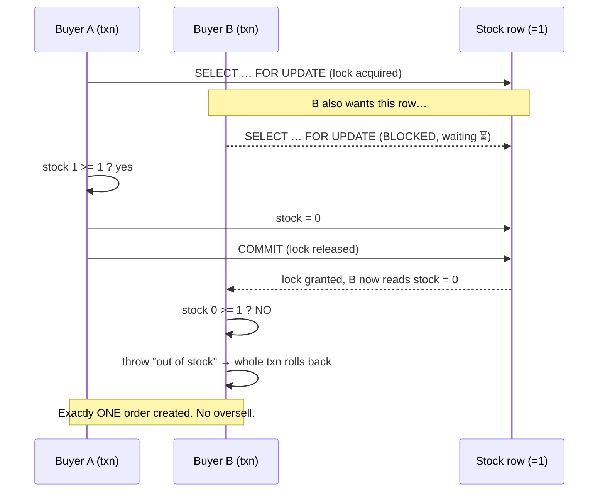

# Chapter 7 — Concurrency & Data Integrity

*Why two shoppers can't both buy the last item — and the transactions and locks that keep your data correct when many things happen at once.*

← [Back to Chapter 6](06-payments-and-third-party-integrations.md) · Next → [Chapter 8: Scalability](08-scalability-and-performance.md)

---

## 🧠 The Concept: concurrency, and the trouble it brings

Your server doesn't handle one customer at a time. At any instant, dozens of requests may be running **simultaneously** — that's **concurrency**. Usually they don't interfere. But when two requests touch the *same* data at the *same* time, things can go subtly, expensively wrong.

The classic example: **one item left in stock, two buyers.**

```
Stock = 1

Buyer A's request                Buyer B's request
-----------------                -----------------
read stock → 1                   read stock → 1        (both saw 1!)
1 >= 1 ? yes                     1 >= 1 ? yes
write stock = 0                  write stock = 0
create order ✓                   create order ✓        ← OVERSOLD: two orders, one item
```

Both requests *read* "1 in stock," both concluded "yes, available," both wrote "0." You sold an item you don't have. Nobody wrote buggy logic — the bug is *purely* in the timing of two correct-looking operations interleaving. These are **race conditions**, and they're among the hardest bugs because they only appear under load and rarely reproduce on demand.

---

## 🧠 The Concept: TOCTOU — the shape of the bug

The pattern above has a name: **TOCTOU — "Time Of Check To Time Of Use."** You *check* something ("is stock available?") and then *use* it ("decrement stock"), but in the gap between check and use, *someone else changed it.* Your decision was based on stale information.

TOCTOU bugs aren't just about stock. The same shape causes:
- a coupon used more times than its limit,
- a discount code redeemed twice,
- two users grabbing the same username,
- the OTP attack we discussed in [Chapter 3](03-authentication-and-authorization.md).

Fixing them requires making "check **and** use" happen as one **indivisible** step that nobody can interleave with. That's what transactions and locks give you.

---

## 🧠 The Concept: ACID transactions

A **transaction** groups several database operations into one **all-or-nothing** unit. Either *every* step succeeds and is saved ("commit"), or *any* failure undoes the whole group ("rollback") as if nothing happened.

Why this matters for an order: creating an order is really *many* writes — insert the order, insert each line item, decrement each product's stock, increment coupon usage, clear the cart. If the server crashed halfway, you'd have a half-order: stock decremented but no order recorded, or an order with no line items. A transaction guarantees you never end up in that broken middle state.

Transactions are defined by four guarantees, **ACID**:

- **Atomicity** — all-or-nothing (no half-done work).
- **Consistency** — the database moves from one valid state to another (rules/constraints hold).
- **Isolation** — concurrent transactions don't see each other's half-finished work; the result is as if they ran one after another.
- **Durability** — once committed, it survives crashes/power loss.

> Atomicity is the headline: wrap a multi-step operation in a transaction and a failure anywhere rewinds *everything*. The customer is never charged-but-order-less due to a mid-way error.

---

## 🧠 The Concept: locking — optimistic vs. pessimistic

Transactions give all-or-nothing, but to stop the *oversell race* specifically, you also need to stop two transactions from reading the same row at the same time. That's **locking**. Two philosophies:

### Pessimistic locking — "assume conflict; lock first"
When you read the row, you **lock** it (`SELECT … FOR UPDATE`). Any other transaction that wants that row must **wait** until you finish and release it. Conflicts are *prevented* because only one transaction touches the row at a time.

```
Buyer A: lock stock row → read 1 → check → write 0 → commit (release)
Buyer B:        ⏳ waiting for the lock …………………………… → now reads 0 → "out of stock" ✓
```

- ✅ Bulletproof for hot, high-contention rows (the last item, a popular coupon).
- ❌ Others wait; overuse can cause slowdowns or **deadlocks** (see below).

### Optimistic locking — "assume no conflict; check at the end"
Don't lock. Add a `version` (or timestamp) column. Read the row and its version, do your work, then when writing say "update *only if* the version is still what I read." If someone changed it meanwhile, the version moved, your update affects zero rows, and you detect the conflict and retry.

- ✅ No waiting — great when conflicts are *rare*.
- ❌ Wasted work on retry — bad when conflicts are *common*.

**Choosing:** high contention on a specific row (stock, coupons) → **pessimistic**. Rare conflicts (editing your profile) → **optimistic**. Your project uses pessimistic locking exactly where contention is real: stock and coupons.

> **Deadlock** — two transactions each hold a lock the other needs, so both wait forever. Databases detect this and kill one. You avoid it mainly by always acquiring locks in a consistent order and keeping transactions short.

---

## 🧠 The Concept: idempotency as integrity (recap)

We met **idempotency** in [Chapter 6](06-payments-and-third-party-integrations.md): keying an operation on a unique ID so repeating it doesn't duplicate the effect. It's the *integrity* tool for the case where the *same logical operation* arrives more than once (browser retry + webhook). Locking handles *different* operations colliding on *shared data*; idempotency handles the *same* operation arriving *twice*. A robust checkout needs both.

---

## 🔍 In Your Project

Your `CartService::createOrder` (`app/Services/CartService.php`) is a compact masterclass in everything above. It layers **three** integrity defences.

### Defence 1 — idempotency guard (before the transaction)

```php
if (!empty($payment['razorpay_payment_id'])) {
    $existing = Order::where('razorpay_payment_id', $payment['razorpay_payment_id'])->first();
    if ($existing) return $existing;   // same payment, already ordered → no duplicate
}
```

Handles the "same operation twice" case (browser + retried webhook).

### Defence 2 — the whole thing is one transaction

```php
return DB::transaction(function () use (...) {
    // … read cart, create Order, create OrderItems, decrement stock, increment coupon, clear cart …
});
```

Everything inside is **atomic**. If *any* step throws — including "out of stock" below — the database rolls the entire thing back: no partial order, no orphaned stock decrement, cart untouched. The customer's earlier successful payment is then flagged for refund (the controller logs it) rather than leaving corrupt data.

### Defence 3 — pessimistic locks on the contended rows

Inside the transaction, both the **coupon** and each **product's stock** are read with `lockForUpdate()` — pessimistic locking — and re-validated *while locked*:

```php
// Stock (the oversell defence), per cart item:
$product = Product::where('id', $item->product_id)->lockForUpdate()->first();
if (!$product || $product->stock < $item->quantity) {
    throw new CheckoutException(
        $item->product->name . ' just went out of stock. Your order was not placed and you have not been charged.'
    );
}
$product->decrement('stock', $item->quantity);
```

Because the row is **locked**, Buyer B's transaction *cannot* read that stock row until Buyer A commits. By the time B proceeds, it sees the *updated* stock and correctly fails — **no oversell.** This is the race from the top of the chapter, solved. (Sized products lock the matching `product_sizes` row the same way.)

The coupon gets identical treatment so its per-user and global usage limits can't be exceeded by two simultaneous redemptions:

```php
// resolveCoupon(..., $lock = true) inside the transaction:
$coupon = Coupon::where('code', $code)->lockForUpdate()->first();
// re-validate against limits, then later: $coupon->incrementUsage();
```

Notice the design detail: the *same* `resolveCoupon` method is used both for the read-only cart preview (no lock) and the order transaction (locked) — controlled by a `$lock` flag. One pricing rule, two locking modes, zero drift ([Chapter 1](01-mvc-and-request-lifecycle.md)).

### The same pattern guards OTP verification

Integrity-under-concurrency isn't only for checkout. Your OTP check ([Chapter 3](03-authentication-and-authorization.md)) is wrapped in a transaction with `lockForUpdate` for precisely the TOCTOU reason — so two simultaneous verification attempts can't both slip past the 5-attempt cap or both consume the code:

```php
// app/Http/Controllers/AuthController.php — verify()
$row = DB::table('otp_codes')->where('email', $email)
        ->where('expires_at', '>', now())
        ->orderByDesc('id')->lockForUpdate()->first();   // lock → check attempts → compare → consume
```

### Why InnoDB was non-negotiable

Recall from [Chapter 2](02-data-modeling-and-orm.md) that `config/database.php` pins the **InnoDB** engine with a pointed comment: *"Transactions + lockForUpdate silently no-op on MyISAM."* That's the punchline of this whole chapter — every defence above (`DB::transaction`, `lockForUpdate`) **only works because the storage engine supports it.** On the wrong engine the code would *look* identical but silently do nothing, and you'd oversell. The engine choice is a real correctness decision.

### 📊 Diagram: two buyers, one item — solved by a lock



Compare this to the broken interleaving at the top of the chapter: the only difference is the lock, which forces B to *wait and re-read* instead of acting on stale data.

---

## ✅ Takeaways

1. **Concurrency** means many requests run at once; when they touch the same data, **race conditions** (especially **TOCTOU** — check-then-use on stale data) cause corruption like overselling.
2. **Transactions** make a multi-step operation **atomic** (all-or-nothing) and give the **ACID** guarantees — no half-finished orders, even on crash.
3. **Pessimistic locking** (`SELECT … FOR UPDATE`) prevents conflicts on hot rows by making others wait; **optimistic locking** detects rare conflicts at write time and retries. Use pessimistic for high-contention data (stock, coupons).
4. **Locking** stops *different* operations colliding on shared data; **idempotency** stops the *same* operation duplicating. A correct checkout needs **both** — and your `createOrder` has both, inside one transaction.
5. These tools only work on a database engine that supports them — your project deliberately pins **InnoDB** for exactly this reason.

Next: making it all fast and able to grow → [Chapter 8: Scalability & Performance](08-scalability-and-performance.md)
