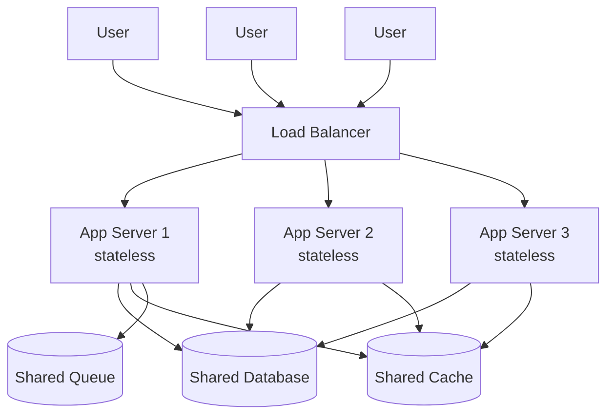
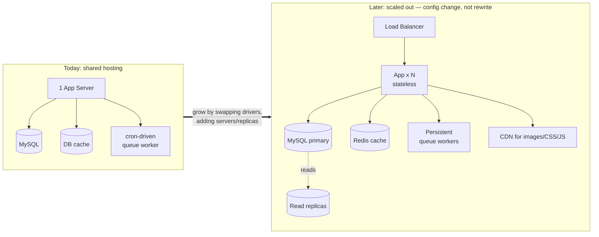

# Chapter 8 — Scalability & Performance

*How a backend stays fast under load and grows from ten visitors to ten thousand — caching, background jobs, scheduled tasks, and scaling out.*

← [Back to Chapter 7](07-concurrency-and-data-integrity.md) · Next → [Chapter 9: Testing & System Design](09-testing-and-system-design.md)

---

## 🧠 The Concept: performance vs. scalability (not the same thing)

- **Performance** — how fast a *single* request is. "The shop page loads in 200ms."
- **Scalability** — how well the system holds up as *load grows*. "It's still 200ms with 5,000 concurrent users."

A site can be fast with one user and collapse with a thousand. The goal is to be fast *and* to stay fast as you grow. The techniques overlap, so we treat them together.

---

## 🧠 The Concept: two ways to scale

When one server isn't enough, you have two options:

- **Vertical scaling ("scale up")** — give the one server a bigger engine: more CPU, more RAM. Simple, but there's a ceiling (and a price cliff) — you can only buy so big, and it's a single point of failure.
- **Horizontal scaling ("scale out")** — run *many* servers and put a **load balancer** in front to spread requests across them. Near-limitless, and if one server dies the others carry on.

Horizontal scaling is how big systems grow — but it only works if your app obeys one rule:

### Statelessness — the enabler of scale
If a user's request can land on *any* server, then **no server may hold private state about that user in its own memory.** Imagine login data stored in Server A's RAM: the user's next request hits Server B, which has never heard of them — logged out randomly. 

The fix: keep shared state in **shared stores** that all servers reach — the database, a shared session store, a shared cache. The app servers themselves become **stateless** and interchangeable: any request, any server, same result. (This is why [Chapter 1's](01-mvc-and-request-lifecycle.md) "each request stands alone" mattered, and why [Chapter 3's](03-authentication-and-authorization.md) session lives in a store, not in memory.)



Notice: the app servers hold *nothing* private. Everything shared lives below them, reachable by all. That's what makes "just add another server" possible.

---

## 🧠 The Concept: caching — don't recompute what hasn't changed

The fastest work is the work you skip. A **cache** is a small, very fast store (often in memory, e.g. **Redis**) where you keep the *results* of expensive operations so you can reuse them instead of recomputing.

The standard pattern is **cache-aside**:

```
1. Need some data → look in the cache first.
2. HIT  (it's there) → return it instantly. Done.
3. MISS (not there) → compute it the slow way (query the DB),
   store the result in the cache, then return it.
```

Two parameters define every cache entry:

- **TTL (Time To Live)** — how long before the entry auto-expires. Short TTL = fresher but more misses; long TTL = faster but riskier staleness.
- **Invalidation** — proactively *deleting* a cache entry when the underlying data changes, so you don't serve stale data until the TTL runs out.

> There's a famous joke: *"There are only two hard things in computer science: cache invalidation and naming things."* Caching is a *correctness* trade — you accept possibly-slightly-stale data in exchange for speed, and the art is deciding *what* to cache, *how long*, and *when to bust it*.

What's safe to cache? Data that's **read often but changes rarely**: your category list, site settings, a homepage feed. What you generally *don't* cache: per-user, fast-changing, or money-critical data (a live cart, current stock).

---

## 🧠 The Concept: asynchronous work & queues

Some work is slow (sending an email, generating a PDF, calling a third-party API) and the user shouldn't have to *wait* for it. Making them wait is **synchronous** ("do it now, while you watch"). The alternative is **asynchronous** ("I'll handle it in the background; you carry on").

The tool is a **job queue**:

1. During the request, instead of doing the slow thing, you drop a **job** ("send receipt email for order #123") onto a **queue** and immediately respond to the user.
2. A separate process, a **worker**, pulls jobs off the queue and runs them in the background.

Benefits: snappy responses, and the slow work is **retryable** — if the email provider is down, the worker can try again later instead of failing the user's checkout. Robust queues add **retries with backoff** and a **dead-letter queue** (a holding pen for jobs that fail repeatedly, so a human can inspect them).

```
Request: "place order" → drop [send-receipt] job on queue → respond NOW (fast)
                                       |
Worker (separate, later): pick up [send-receipt] → send email → (retry if it fails)
```

---

## 🧠 The Concept: scheduled / cron tasks

Some work isn't triggered by a user at all — it runs *on a clock*. "Every night, delete expired records." "Every week, refresh an API token." These are **scheduled tasks** (the Unix tradition calls the scheduler **cron**). They handle housekeeping, maintenance, and periodic syncs that keep the system healthy without anyone clicking anything.

---

## 🧠 The Concept: database performance (where most slowness lives)

In most web apps, the database is the bottleneck before the app code is. Key levers:

- **Indexes** — covered in [Chapter 2](02-data-modeling-and-orm.md); the single biggest query-speed lever. The right index turns a full-table scan into an instant lookup.
- **The N+1 query problem** — the ORM trap. Looping over 50 orders and lazily loading each order's user = 1 query for the orders + 50 for the users = **51 queries.** The fix is **eager loading**: tell the ORM up front "also fetch the users," collapsing it to **2** queries. Same data, 25× fewer round-trips.
- **Read replicas** — copies of the database that handle read queries, spreading load off the primary (which handles writes). Reads usually vastly outnumber writes, so this scales reads cheaply.
- **Denormalization** ([Chapter 2](02-data-modeling-and-orm.md)) — storing a pre-computed value (like a product's review count) so reads don't recompute it. A performance tool, used sparingly.

---

## 🧠 The Concept: the CDN (for the frontend's sake)

A **Content Delivery Network** caches static files (images, CSS, JavaScript) on servers physically close to your users worldwide, and serves them instead of your origin server. Two wins: pages load faster (the bytes travel a shorter distance), and your backend is freed from serving heavy static files so it can focus on dynamic work. Not used heavily in your project, but it's a core scaling concept worth knowing.

---

## 🔍 In Your Project

Your project is deployed on **modest shared hosting**, which makes its scaling choices especially instructive — it gets the *concepts* right within tight constraints, and is structured so it can scale up later by changing config, not code.

### Caching — read-often, change-rarely data

Your app caches exactly the right things: the catalog scaffolding that every page needs but that changes only when an admin edits it. From `ProductController` and others:

```php
// 24-hour cache of the category list (cache-aside via Cache::remember):
$categories = Cache::remember('all_categories', 86400, fn () => Category::withCount('products')->get());
```

Cached entries include `all_categories`, `all_tags`, `shop_filter_counts`, the Instagram feed, and site `settings` (cached *forever* since they rarely change). And — crucially — it does **invalidation**, not just expiry. When an admin changes a product or category, `AdminController::flushCatalogCache()` explicitly forgets those keys so customers see the change immediately rather than waiting 24 hours:

```php
Cache::forget('all_categories');
Cache::forget('all_tags');
Cache::forget('shop_filter_counts');
// … busted on product/category create/update/delete
```

That's the full cache-aside lifecycle — *remember on read, forget on write* — exactly as the concept describes. The settings cache is busted the moment a setting is saved (`Setting::set()`), so config changes are instant.

### Ready to scale: the cache driver is swappable

Your `config/cache.php` defaults to the **database** cache driver (works anywhere, no extra service — good for shared hosting) but **Redis is already configured** on a separate connection. Moving to a faster in-memory cache for production is a one-line `.env` change (`CACHE_STORE=redis`) — *no code changes*, because the app only ever calls the generic `Cache::` interface. That's the statelessness/shared-store principle paying off: the app doesn't care *where* the cache lives.

### Asynchronous work — the queue, adapted to constraints

Slow emails (order receipts, invoices) are handled through Laravel's **queue** rather than blocking the request. But here's the real-world wrinkle: shared hosting can't run a always-on worker process. So your project uses a clever adaptation in `routes/console.php`:

```php
// Process queued emails (OTP, invoice) once per minute via the scheduler cron
Schedule::command('queue:work --once --tries=3 --max-time=50')->everyMinute()->withoutOverlapping();
```

Instead of a permanent worker, the scheduler **starts a short-lived worker every minute** that drains the queue and exits — with `--tries=3` (the retry concept) and `--max-time=50` (don't run long). It's a pragmatic substitute for a daemon, and it demonstrates that *the queue concept is the same even when the infrastructure is humble.*

> One deliberate exception: **OTP emails are sent synchronously** (`Mail::sendNow` in `AuthController::sendOtp`), *not* queued. Why? An OTP that arrives a minute late (waiting for the next cron tick) is useless — the user is staring at the verify screen *now*. So your code consciously chooses synchronous for the latency-critical email and async for the rest. Choosing sync vs. async *per task* is exactly the right instinct.

### Scheduled housekeeping

Your `routes/console.php` schedule keeps the system healthy on a clock — the cron concept in practice:

| Task | Schedule | Why |
|---|---|---|
| `otp:cleanup` | every 30 min | delete expired OTP rows so the table doesn't bloat |
| `session:gc` | daily | clear out dead sessions |
| `instagram:refresh-token` | weekly | renew the API token before it expires (~60 days) |
| `queue:work --once` | every minute | drain the email queue (above) |

### Database performance habits

- **Indexes** are placed deliberately across products/orders/etc. ([Chapter 2](02-data-modeling-and-orm.md)) — the foundation of fast reads.
- **Eager loading** is used to dodge N+1. For example `AuthController::account` loads orders *with* their items and products in one go (`->with('items.product')`), and the cart loads `CartItem::with('product')` — fetching related rows in a couple of queries instead of one-per-row.
- **Denormalized aggregates** (`products.rating`, `review_count`) mean product listings don't recompute ratings from the reviews table on every page.
- A neat extra: a **view composer** in `AppServiceProvider` computes the user's cart-count and wishlist IDs **once per request** and shares them with every view, instead of each navbar/component re-querying. That's request-level memoization — the same "compute once, reuse" instinct as caching, at smaller scale.

### 📊 Diagram: where your project is, and where it can grow



Because the app is stateless and talks to swappable shared stores, the jump from left to right is mostly **configuration and infrastructure**, not a rewrite. *Designing for that future without over-building today is the real scalability skill.*

---

## ✅ Takeaways

1. **Performance** is single-request speed; **scalability** is staying fast as load grows. Aim for both.
2. **Scale up** (bigger server) hits a ceiling; **scale out** (many servers + load balancer) is how you grow — but only if the app is **stateless**, keeping shared state in shared stores (DB, cache, session). Your project follows this and can swap its cache to Redis via config alone.
3. **Caching** (cache-aside) reuses expensive results; manage it with **TTL** and **invalidation**. Cache read-often/change-rarely data — your project caches categories/tags/settings and *busts them on admin edits.*
4. **Queues** push slow work (emails, PDFs) to background **workers** with retries; choose **sync vs async per task** — your project queues invoices but sends OTPs synchronously for latency.
5. **Scheduled/cron tasks** handle clock-based housekeeping (your OTP cleanup, token refresh, even the cron-driven queue worker).
6. The database is the usual bottleneck: **indexes**, avoiding **N+1** via **eager loading**, **read replicas**, and careful **denormalization** are your levers — all present in your project.

Final chapter: proving it works, and reading *any* backend → [Chapter 9: Testing & System Design](09-testing-and-system-design.md)
