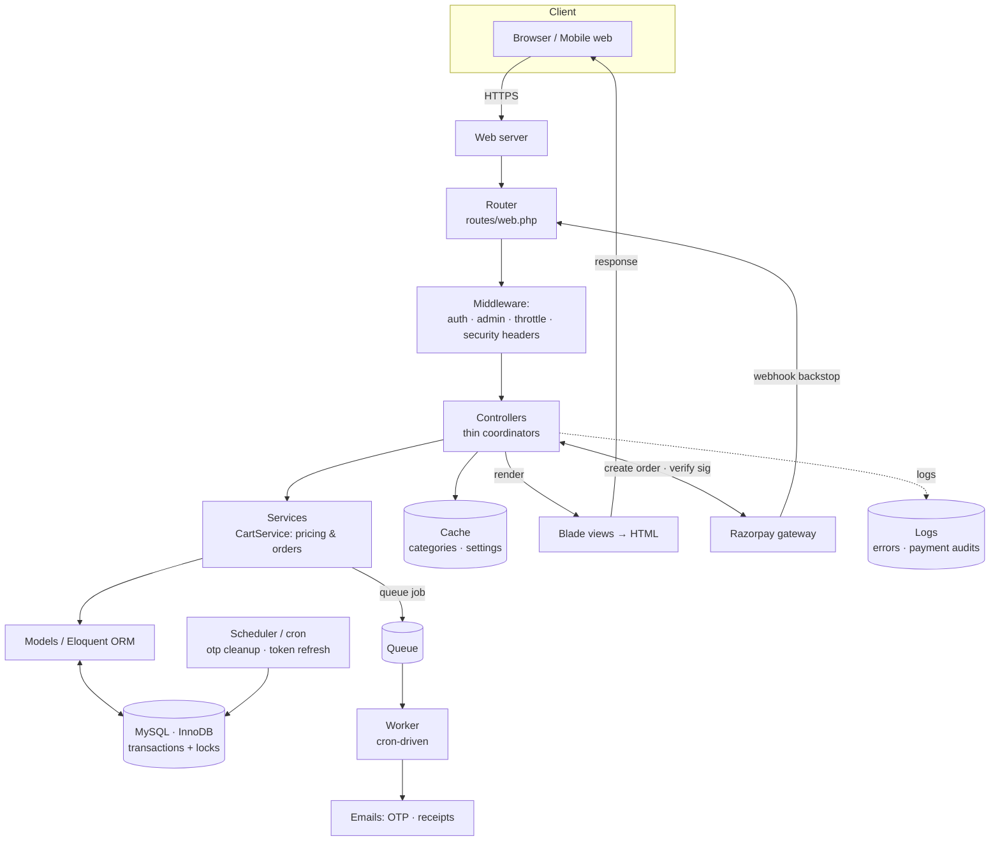

# Chapter 9 — Testing & System Design

*Proving the backend actually works, the bigger picture that ties every chapter together, and a repeatable method for understanding **any** backend project.*

← [Back to Chapter 8](08-scalability-and-performance.md) · [Back to index](00-README.md)

---

# Part A — Testing

## 🧠 The Concept: why automated tests exist

You changed the discount logic. Did you just break checkout? You *could* click through the whole site by hand every time — but that's slow, and you'll forget cases. **Automated tests** are code that checks your code: they set up a scenario, run the real logic, and *assert* the result is what you expect. Run them in seconds, on every change, forever.

Tests buy you two things money can't otherwise:

- **Confidence to change** — a "regression" (re-breaking something that used to work) gets caught instantly, so you can refactor without fear.
- **Executable documentation** — a test named `test_oversell_is_rejected_and_rolls_back` *tells you* what the system promises, and proves it's still true.

The mantra: **test the behaviour you're afraid to get wrong.** You don't test trivial code; you test the parts where a bug costs money or trust.

---

## 🧠 The Concept: the testing pyramid

Not all tests are equal. The industry pictures them as a pyramid — many cheap ones at the bottom, few expensive ones at the top:

```
        /\         End-to-end (E2E): drive the whole app like a user.
       /  \        Slowest, most realistic, most brittle. Have a FEW.
      /----\
     /      \      Integration / Feature: several pieces together
    /        \     (a real request hits routes→controller→DB).
   /----------\    Medium speed. Have MANY of the critical paths.
  /            \
 /--------------\  Unit: one function/class in isolation.
                   Fastest, most focused. Have LOTS.
```

- **Unit test** — one small piece alone (e.g. "does the discount formula return the right number?"). Microseconds.
- **Integration / feature test** — several pieces working together (e.g. "POST to checkout actually creates an order and decrements stock"). This is where backends get the most value, because bugs often hide *between* components.
- **End-to-end (E2E)** — the whole system, often through a real browser. Most realistic, slowest, most fragile — so you keep these few and reserve them for the most important journeys.

**Fixtures & factories** make this practical: a **factory** generates fake-but-valid test data (a throwaway product, a test user) so each test starts from a known, clean state. A common helper **refreshes the database** between tests so they never pollute each other.

---

## 🔍 In Your Project

Your `tests/` folder has a focused, well-chosen suite (PHPUnit, the standard PHP testing tool) — and it tests *exactly* the scary parts we covered in earlier chapters:

| Test file | Type | Protects the lesson from… |
|---|---|---|
| `Unit/ProductFinalPriceTest.php` | unit | the `final_price` discount formula ([Ch 2](02-data-modeling-and-orm.md)) |
| `Unit/CouponTest.php` | unit | coupon validity & discount math |
| `Feature/CheckoutTest.php` | feature | the whole order pipeline ([Ch 6](06-payments-and-third-party-integrations.md), [Ch 7](07-concurrency-and-data-integrity.md)) |
| `Feature/OtpFlowTest.php` | feature | registration & OTP verification ([Ch 3](03-authentication-and-authorization.md)) |
| `Feature/AuthSecurityTest.php` | feature | login throttling / lockout ([Ch 5](05-rate-limiting-and-abuse-prevention.md)) |
| `Feature/AdminAccessTest.php` | feature | role-based access control ([Ch 3](03-authentication-and-authorization.md)) |
| `Feature/AccountIsolationTest.php` | feature | users can only see *their own* data |
| `Feature/ReviewRatingTest.php` | feature | the denormalized rating recompute ([Ch 2](02-data-modeling-and-orm.md)) |
| `Feature/AdminImageUploadTest.php` | feature | admin product image handling |

Look at the actual test method names in `CheckoutTest.php` — they read like a **specification of promises** the system makes:

```
test_cod_order_is_created_and_stock_decremented
test_order_charges_the_discounted_final_price
test_oversell_is_rejected_and_rolls_back          ← the Chapter 7 race, proven
test_sized_product_oversell_is_rejected
test_paid_order_is_idempotent_on_payment_id       ← the Chapter 6 idempotency, proven
test_empty_cart_throws
test_valid_coupon_discount_is_applied_at_checkout
test_per_user_exhausted_coupon_is_ignored_at_checkout
```

Every hard concept from this course — discount-correct pricing, **oversell rollback**, **payment idempotency**, coupon limits — has a test *guarding* it. That's not by accident; that's a developer who identified the high-risk behaviours and locked them down. The suite uses a database-refresh between tests so each runs against a clean slate (the "fixtures" idea), and factories to mint test products/users.

> **How you'd run them** (for reference, you don't have to): `php artisan test`. Green = every promise still holds; red = something regressed, with the failing assertion pointing at what.

---

# Part B — System Design: the whole picture

## 🧠 The Concept: environments & the 12-Factor App

The same code runs in different **environments**:

- **Development** (your laptop) — convenient settings: SQLite or local MySQL, emails written to a log file instead of actually sent, detailed error pages, dummy payment keys.
- **Production** (the live server) — real MySQL, real SMTP, real payment keys, errors hidden from users, HTTPS enforced.

The code must be *identical* across them; only **configuration** differs. This is a core idea of the widely-used **"12-Factor App"** methodology, whose most important rule you've already met: **store config in the environment** (`.env`), never in code ([Chapter 4](04-security.md)). Other 12-factor ideas you've seen in action: treat backing services (DB, cache, queue) as swappable attached resources ([Chapter 8](08-scalability-and-performance.md)), and keep app processes **stateless** ([Chapter 8](08-scalability-and-performance.md)).

Your project embodies this: `.env.example` shows dev defaults (SQLite, `MAIL_MAILER=log`, dummy Razorpay keys), while production flips the same variables to real services — *zero code change*. The `AppServiceProvider` even adapts the public path for the specific quirk of cPanel hosting, isolating an environment difference in one place.

## 🧠 The Concept: observability (you can't fix what you can't see)

Once live, you need to *see* what the backend is doing. Three pillars:

- **Logs** — timestamped records of events ("Razorpay signature verification failed," "order/payment amount mismatch"). The first place you look when something breaks.
- **Metrics** — numbers over time (requests/sec, error rate, response time, queue depth). They tell you *that* something's wrong and trend toward problems.
- **Traces / alerts** — following one request across components, and getting *paged* when a threshold breaks (error rate spikes, payments failing).

Your project leans on **logging** deliberately and well: it logs failed payment signatures, paid-but-unfulfilled orders (with the payment ID so staff can refund), amount mismatches for manual review, and webhook problems. Notice the *level* matters — `logger()->warning()` for "expected but notable," `logger()->error()` for "a human should look." That distinction is what makes logs useful instead of noise. This is the **reconciliation/audit-trail** habit from [Chapter 6](06-payments-and-third-party-integrations.md) in its broader form.

## 🧠 The Concept: trade-offs are the job

There's no perfect backend, only appropriate ones. Every chapter had a trade-off:

- Normalize (correct) vs. denormalize (fast) — [Ch 2](02-data-modeling-and-orm.md)
- Sessions (simple, stateful) vs. tokens (scalable, complex) — [Ch 3](03-authentication-and-authorization.md)
- Tight CSP (secure) vs. `unsafe-inline` (works with existing code) — [Ch 4](04-security.md)
- Pessimistic locks (safe) vs. throughput (fast) — [Ch 7](07-concurrency-and-data-integrity.md)
- Caching (fast) vs. staleness (possibly wrong) — [Ch 8](08-scalability-and-performance.md)
- Sync OTP (instant) vs. async queue (scalable) — [Ch 8](08-scalability-and-performance.md)

Senior engineering isn't knowing the "right" answer — it's **choosing the right trade-off for *this* situation and documenting why.** Your codebase does this repeatedly in its comments ("tightening CSP is a separate refactor," "OTP sent synchronously so it works without a queue worker"). Reading those comments teaches you more about engineering judgment than any tutorial.

## 📊 Diagram: your whole system on one page



Every box in that diagram is a chapter of this course. You now know what each one does and *why it's there.*

---

# Part C — How to read ANY backend project

This is the payoff you asked for: a repeatable method to walk into an unfamiliar backend — any language, any framework — and understand it fast. Follow the **data and control flow**, in this order:

1. **Find the routes / endpoints.** *What can this app even do?* The route list (here: `routes/web.php`) is the table of contents — every feature is a URL mapped to code. Read it first; it orients everything else.

2. **Follow a route to its controller.** Pick one interesting endpoint (e.g. checkout) and read the controller method. Controllers are *thin* coordinators, so this shows you the shape of the operation without the gory detail.

3. **Find the business logic (services/models).** The controller will delegate the real decisions. Follow it into the service/model layer (here: `CartService`). *This is where the actual rules live* — pricing, order creation, validation.

4. **Find the data model.** Open the migrations/schema and the models (here: `database/migrations/`, `app/Models/`). *What are the core entities and how do they relate?* Once you know the nouns (User, Product, Order) and their links, the whole domain clicks into place.

5. **Spot the middleware / auth.** *Who's allowed to do what?* Look at how routes are grouped and what guards them (here: `auth`, `admin`, `throttle`). This reveals the security model in one glance.

6. **Find where data leaves the system.** *What external services does it touch?* Search for payment gateways, email, third-party APIs (here: Razorpay, SMTP, Instagram). These are the integration points — and usually where the interesting failure handling lives.

7. **Find the async & scheduled work.** *What happens off the request?* Look for queues/jobs and the scheduler (here: `routes/console.php`). Background and cron tasks reveal the housekeeping and the things too slow to do inline.

8. **Read the tests.** *What does the team consider important and fragile?* The test names are a free specification of the system's promises (you saw this above).

9. **Read the comments on the hard parts.** Good codebases explain *why*, not *what*. The comments in `CartService`, `SecurityHeaders`, and `AuthController` of *this* project are a model of that — they capture the trade-offs and the lessons learned.

Run that nine-step pass and you'll understand the *architecture* of almost any backend in an hour — without reading every line, and without needing to be fluent in its language. That's exactly what we did to *build this course*.

---

## ✅ Takeaways

1. **Automated tests** give you confidence to change and double as executable documentation. Follow the **pyramid**: many fast **unit** tests, many **integration/feature** tests on critical paths, a few **E2E**. Test the behaviour you're afraid to get wrong.
2. Your project's suite guards exactly the hard concepts — **oversell rollback**, **payment idempotency**, **coupon limits**, **OTP flow**, **access control** — proving each promise still holds.
3. The same code runs across **environments**, differing only by **configuration** (the **12-Factor** rule: config in `.env`, stateless processes, swappable backing services). Your project is built this way.
4. **Observability** (logs, metrics, alerts) lets you see and fix production. Your project logs payment failures, mismatches, and webhook issues at appropriate **levels** for an audit trail.
5. Engineering is **choosing and documenting trade-offs**, not finding one perfect answer — and your codebase's comments are a great teacher of that judgment.
6. To understand *any* backend: **routes → controller → services/models → data model → middleware/auth → external integrations → async/scheduled → tests → comments.** That nine-step pass is your transferable superpower.

---

🎉 **You've finished the course.** You set out to understand backend concepts well enough to read any project — and you now have the vocabulary and the mental models for MVC, data modeling, auth, security, rate limiting, payments, concurrency, scalability, and system design, anchored in a real codebase you own. Revisit any chapter anytime from the [index](00-README.md).
